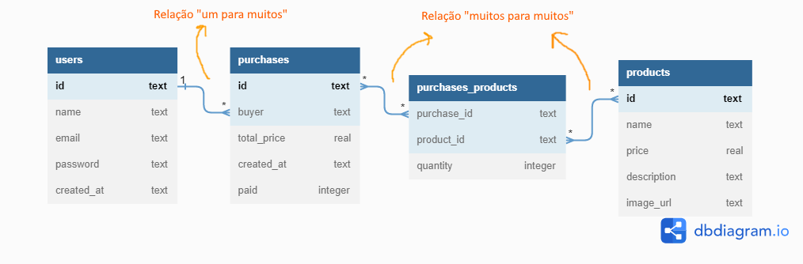

# Projeto Labecommerce - Labenu

## Introdução

- 
 API para aplicativo de gestão de compras.

- 
 Aplicação back-end de servidor express com banco de dados sqlite3.

## Documentação

- ["Link"](https://documenter.getpostman.com/view/24460668/2s8ZDeUeVe)

## Diagrama

## 🛠Conteúdos abordados

1. [Node JS]
2. [Typescript]
3. [Express]
4. [SQL e SQLite]
5. [Knex]
6. [Postman]

## 🖨Descrição do Projeto

API onde é possivel realizar o cadastro de clientes, de produtos e de compras feitas por cada cliente.

## 🖋Autor

- Lucas Marques
- Email: lucas.marks8@gmail.com
- Tel: 11 96997-5003
- ["Linkedin"](https://www.linkedin.com/in/lucas-henrique-marques/)